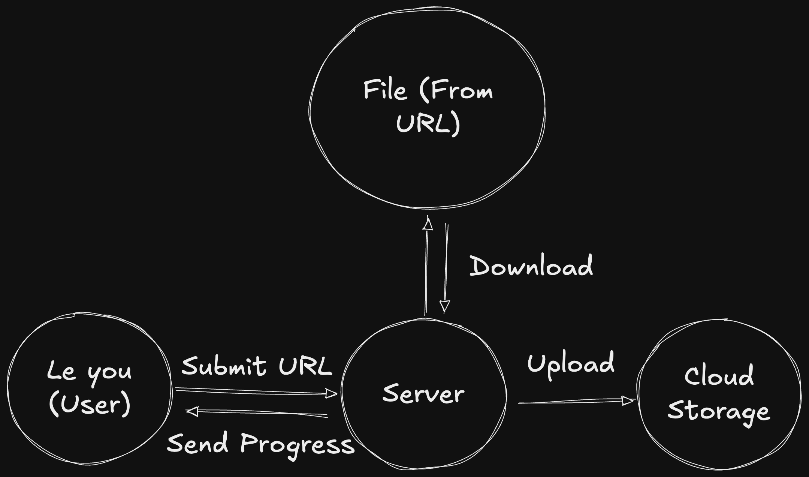
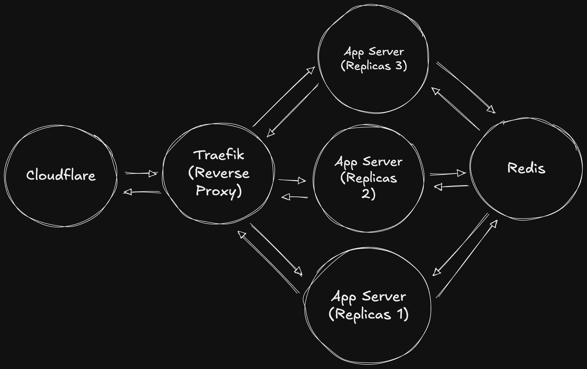
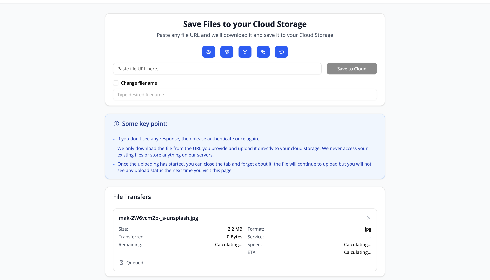
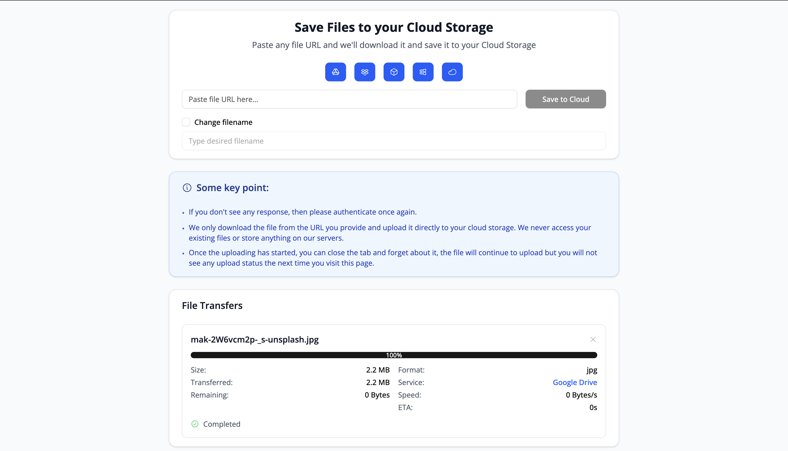

Hello again world!

Now that [Save to Cloud](https://savetocloud.finmavis.dev) is live and ready, I'm excited to finally share it and tell you all about what it is, why I built it, and all the things that I wanna share.

## What the heck is [Save to Cloud](https://savetocloud.finmavis.dev)?

Imagine this, you're browsing the internet and find an awesome file online (maybe a PDF, image, or video) and you want to save it to your cloud storage. Instead of manually doing the download, then waiting for the download to complete, then uploading it and waiting again for the upload to complete, you can just paste the URL into [Save to Cloud](https://savetocloud.finmavis.dev) and the app does all the heavy lifting for you, it will downloads the file and uploads it straight to your preferred cloud storage (Google Drive, Dropbox, you name it).

Quite simple and straightforward right?

## The Backstory

Here's the thing, [Save to Cloud](https://savetocloud.finmavis.dev) was born from my own tiny problem that turned into a real pain in the you-know-what.

You see, sometimes I find cool or awesome files online and think "Oh, I should save this to my Google Drive!" Then I will download the files, wait for the download to finish, upload it to Google Drive, and wait again until the upload is finished.

But here's the problem, I live in a country where internet speed is... well, let's just say we're always winning the fastest internet speed awards, from the **BOTTOM**! We're actually among the slowest in ASEAN, which is pretty sad when you think about it!

And to make it worse, our internet providers decided to get really, really, really creative with their "innovative" data plans. Imagine paying a small fortune for a plan that gives you, say, only 500MB of data. The prices are absolutely bonkers in my opinion, and the quality? Well, let's just say it's consistently inconsistent. Sometimes you get decent internet, sometimes you don't, but mostly it's just... snail-paced.

So, because of that, instead of doing it manually and wasting my quota and my precious time to wait download and upload, why don't I torture myself into oblivion for a month to automate this and deploy the app to cloud computing so that it's easier for me to download and upload just by providing a URL. Because why not, right, it sounds fun and I no longer have to waste my internet quota!

## The Architecture

Alright, before we dive into the architecture rabbit hole, let me spill the tea on something important first, I want this be as cheap as possible!

I mean, if you check the [AWS EC2 Pricing](https://calculator.aws/#/createCalculator/ec2-enhancement), just getting 2 vCPU cores and 4GiB of memory in Singapore (closest to me) would set me back around $22 USD. And [Google Cloud](https://cloud.google.com/compute/vm-instance-pricing#shared-core-machine-types)? Same story, my wallet's would be crying!

And welp, that's just the compute costs! We haven't even talked about data transfer yet, remember, we're talking downloads AND uploads here, this app is going to be a data transfer monster. So yeah, I had to get really creative with my architecture approach to keep things both efficient AND wallet-friendly.

Alright, now that we've talked about the cost, let's take a look at the problem we're actually facing. Please see this diagram:

As you can see from the diagram, we have three main problems to tackle:

1. **User interface** - so users can submit the URL and see the progress
2. **Handling the download** - getting that file from wherever it lives on the internet
3. **Handling the upload** - sending it off to your cloud storage of choice

Sounds pretty straightforward, right? Well, not so fast!

If you've been in tech long enough, you know that sometimes the "simple" stuff is actually a sneaky little beast hiding behind a mountain of complexity. We're just really good at making it _look_ easy so users don't have to think about all the technical wizardry happening behind the scenes.

Think of it like ordering food at a restaurant. You want some satay? Just tell the waiter and wait. Bam! Food appears. So simple, right? But behind the scenes, there's a whole kitchen full of chefs, ingredients being prepped, fires being managed, timing everything perfectly... it's actually pretty complex! We just hide all that chaos so you can enjoy your meal in peace.

Same deal here with Save to Cloud, looks simple on the surface, but there's a whole lot of dark magic happening behind the scenes.

So, what are the actual things we need to tackle?

## The User Interface Challenge

First up, the user interface. Since we want to show progress in real-time, I needed a way to send updates from the server to the client instantly.

My first thought? "Oh, should I use WebSockets and libraries like Socket.io?"

But then I actually dug deeper into this problem, and turns out I didn't need Socket.io at all and here's why.

All I really need to do is send progress data from the server to the client, there's no need for any interactivity from the client side. The client's job is just to receive the data and display it. That's it! Simple as that.

And luckily, we have this awesome thing called [Server-Sent Events (SSE)](https://developer.mozilla.org/en-US/docs/Web/API/Server-sent_events).

SSE allows a server to initiate a one-way stream of updates to the client over an HTTP connection. Unlike WebSockets (which allow full-duplex communication, both client and server can send messages), SSE is only one-way, the server sends updates, and the client receives them.

Perfect! SSE is exactly what we need. No overkill, no unnecessary complexity, just a clean, simple solution!

## The Download Part

For downloading files, we have several approaches to tackle this. Let me walk you through my thought process.

**First approach: download the file, save it on the server, then upload it.**

Well, this is actually not ideal at all! Here's why:

- We have to wait for the download to complete before we can even start uploading
- It's like doing it manually, download, wait, then upload!
- It wastes precious server storage space
- I'd have to clean up files after completion
- And honestly, I don't want to save any files on my server at all

**Second approach: Keep Everything in Memory (The Memory Hog)**

So, instead of saving to a file, can we just keep it in memory?

Well, the answer is... kinda yes and no!

Let's say a user wants to download a 10GB file. If we load that entire thing into memory, and I only have 4GB of RAM available, then....... The server crashes because it runs out of memory.

Or imagine this scenario, we have multiple users, let's say 5 users who want to use Save to Cloud simultaneously, and if each user downloads a 1GB file, it would run out of memory immediately. We wouldn't be able to serve a lot of users and wouldn't scale at all!

Not exactly the user experience we're going for! We want the server to be able to handle multiple downloads (well, maybe not a ton because of budget constraints, but at least 5 downloads simultaneously would be nice).

**The Real Final Solution**

The big question: "Can we download and immediately upload as soon as the bytes arrive?"

And the answer is yes! Introducing the [Stream API](https://developer.mozilla.org/en-US/docs/Web/API/Streams_API)!

By streaming the download, we break down the resource we want to receive over the network into small, manageable chunks, then process it bit by bit. It won't overload the memory at all because we're not processing the entire file at once, just small pieces at a time. Plus, I don't have to store any files on my server!

And here's the best part: the [Fetch API body contents](https://developer.mozilla.org/en-US/docs/Web/API/Response/body) is already a Readable Stream! So I can just tap into it and immediately process/upload it as the data flows through.

_Oh, by the way, please be aware that if you use `Response.blob()`, it reads the entire response body (the file) into memory, which is exactly what we're trying to avoid!_

But wait, there's more!

By streaming it, we can actually tackle more problem. Since it's a stream, we can just tap into it and create real-time progress tracking based on the received and processed file data. We can show:

- How many bytes have already been transferred
- How many bytes are remaining
- The current download speed
- ETA to finish

And here's the real game changer, streaming also solves our multiple user problem! Remember when I mentioned that 5 users downloading 1GB files would crash our server? With streaming, each user's download only uses a tiny amount of memory at any given time, just the small chunk being processed, not the entire file.

So now we can handle multiple users downloading large files simultaneously without running out of memory. Each stream processes small chunks independently, and the server can juggle multiple downloads without breaking a sweat.

## The Upload Part

Now for the upload part, honestly, there's not much to talk about here. It's pretty straightforward, I just upload it.

But here's a little trick I implemented to avoid getting flagged as spam by cloud providers. Instead of uploading every single byte as it arrives, I made the upload happen only after we've received 8MB of data.

So the server waits until the bytes received reach 8MB (or more), and then uploads that 8MB chunk. This approach:

- Reduces the number of API calls to cloud providers
- Prevents getting rate-limited or flagged as spam
- Keeps the cloud providers happy! eh, not so sure lol

## The Unexpected Part

Let's go back to our restaurant analogy. Imagine suddenly 50 guests arrive at the restaurant, but the restaurant only has 10 tables to serve. If the restaurant accepts all 50 guests, it would be chaos, right? right? Because it only has 10 tables, so the rest will have to wait.

This same problem applies to Save to Cloud. If suddenly the server is handling 100 requests at one time, it doesn't have to immediately process all of them. If it tries to, then the process becomes less efficient because

1. **Download and upload speeds get significantly reduced** they're shared among all 100 requests, so everyone gets a slow speed
2. **Memory usage** even though we're streaming, it still uses some memory. What if it's 1000 requests instead of 100? You can imagine the horror that would be!

So my solution was, I set the server to handle a maximum of 4 requests at a time. This means if the server is only handling the download and upload of 4 processes, the rest get queued up.

Here's how it works in practice:

- User 1 arrives and makes 2 requests
- User 2 arrives with 1 request
- User 3 arrives with 4 requests

The server will handle 2 requests from User 1, 1 request from User 2, and 1 request from User 3 (since we're at the 4-request limit). The remaining 3 requests from User 3 get queued and will be processed immediately after some of the current downloads/uploads complete.

So, for this, instead of using a library like BullMQ, I kinda wanted to explore the fun part of creating a queue from scratch!

And let me tell you, it was a wild ride. I encountered a lot of problems along the way, but it was incredibly fun and I learned a ton of stuff by doing that. Sure, it's more work, but you understand every single bolt and screw by doing it from scratch.

The queue management handles all the complexity of:

- **Request queuing**: When the server is busy, requests wait in line like customers at a restaurant
- **Priority handling**: Making sure requests are processed in the right order
- **Error handling**: What happens when things go wrong (and they will!)
- **State management**: Keeping track of what's processing, what's queued, and what's done

Building this from scratch made me appreciate the authors of libraries like BullMQ even more, they're doing some serious engineering magic!

## The Tech Stack

To be honest, I didn't put much thought into choosing the tech stack because I already had one particular framework in mind that I wanted to try, [Remix](https://remix.run/) or [React Router v7](https://reactrouter.com/home)!

Remix is a React full-stack web framework that caught my attention. While it initially launched as a paid product, it became completely free and open-source in November 2021. The reason I wanted to test it? It's a quite interesting React framework, and if it's good, then I can probably use it in my professional work too! Win-win, right?

Remix solves these problems for me

1. **Full-stack capabilities** I need a server for the download and upload functionality, and Remix handles both frontend and backend in one framework
2. **Static page generation** It's capable of prerendering some pages like user guide, privacy policy, and terms of service
3. **React for the UI** I can build the user interface using React, which I'm already comfortable with
4. **Not coupled** It's not tightly coupled to any specific deployment platform, so I can deploy it anywhere I want without being locked into one ecosystem

## The Production Setup

For production setup, I kept it simple but scalable, it follows a typical web app architecture with some scaling and load balancing so that it can handle the chaos of real-world usage:

**Domain**

Because I already have this domain (finmavis.dev) and it's managed through Cloudflare, I can just add a subdomain without any extra cost! Cloudflare also provides DNS, SSL termination, and basic protection.

**Reverse Proxy**:

At first, I was gonna use Nginx as usual, but I found this interesting reverse proxy called Traefik and I wanted to try it out! I use Traefik to distribute requests evenly across the replicas (load balancing). This makes the app more responsive and able to handle higher traffic.

**The App Server**:

I don't want to be in a situation where if the server crashes, then it would be immediately dead and inaccessible. At least I still want it to be able to access it, so I set up three app replicas for that.

**Queue Management**:

Last but not least, I use Redis to store the queue data and temporary data like user tokens.

So the final production setup would look like this.

Pretty neat, right?

## Try It Out

It's super simple! Here's how to get started:

### Step 1: Authenticate with Your Cloud Storage

Just go to [Save to Cloud](https://savetocloud.finmavis.dev) and authenticate with your preferred cloud storage. For this example, I'll use Google Drive.

The app will ask for permission to access your cloud storage (don't worry, it's secure!). After the authentication succeeds or fails, it will redirect you back to the [Save to Cloud](https://savetocloud.finmavis.dev) homepage.

### Step 2: Get Your File URL

Now for the fun part, pasting the URL! Just make sure it's a direct link to the file. Let me show you with an example using an image from [Unsplash](https://unsplash.com/photos/a-lone-figure-walks-in-the-light-2W6vcm2p-_s). Credit to [Mak](https://unsplash.com/@mak_jp).

Visit the link above, then navigate to the right corner of the page. You'll see a download button there, click it!

Choose your preferred size, then right-click on it. In my case, I right-click on "Original Size" and choose "Copy Link".

### Step 3: Watch the Magic Happen!

After that, head over to [Save to Cloud](https://savetocloud.finmavis.dev) and paste the URL. Then sit back and watch the magic happen! The app will handle all the magic for you!

It will queue it at first.

And then when it complete, it will look like this.

### A Quick Note About Dropbox

Here's something interesting I discovered while I apply to Dropbox swtiching my app from Testing to Production, Dropbox requires a 50-user quota to fill up for production review, which is pretty weird if you ask me!

If you want to use Dropbox with Save to Cloud, please feel free to reach out to me directly and share your email so I can add you to the app.

### Need More Help?

If you're still unsure, here's the detailed [user guide](https://savetocloud.finmavis.dev/user-guide) that covers everything step by step!

## Wrapping up

Building Save to Cloud was quite the fun and challenging adventure! Here are some key takeaways:

1. **Streaming is your friend**: It solves a lot of problem, memory issues and enables real-time progress tracking, and a lot more!
2. **Queue management matters**: Don't try to handle everything at once
3. **Cost optimization is crucial**: Especially when you're paying out of pocket, this is really important especially if you work in a company that needs to have budget planning efficiently and doesn't burden the company
4. **Sometimes the "simple" solution is the best**: SSE over WebSockets
5. **Building from scratch teaches you a lot**: Instead of using libraries like BullMQ, I tried to build the queue management from scratch and it was a pain and really fun to create! It makes me more amazed at the authors who built these libraries, they're doing some serious magic!

And if you have any questions, feedback, or just want to chat about the technical decisions, feel free to reach out. I'd love to hear your thoughts!
